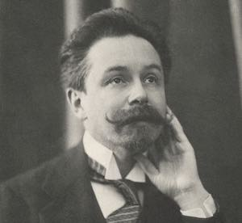

## Willkommen auf der Website des Skrjabin Clubs

### Unsere Aufgaben

- Eine Gemeinschaft zu schaffen, in der Gespräche über Kunst und Leben stattfinden und Gleichgesinnte zusammengebracht werden.
- Eine Musikschule und Lernumgebung von höchster Qualität für Klavierunterricht und allgemeine kulturelle Bildung zu schaffen.
- Einen Ort zu schaffen, an dem [Informationen über Skrjabin und verwandte Themen](/de/post/) ausgetauscht und verbreitet werden.

### Unser Klub

Mitglieder des Skrjabin Klubs arbeiten aktiv an der Förderung kulturellen Bewusstseins, Engagements und Aufklärung.

Die Mitgliedschaft im Skrjabin-Club bietet Vorteile wie die Teilnahme an Konferenzen, Aktivitäten, Konzerten, Treffen, Vorträgen, Kursen und mehr. 
Die Zahl unserer Anhänger und Mitglieder wächst ständig. 
Erfahren Sie mehr [über den Skrjabin-Club](/de/club/).

### Unsere Sponsoren

Möchten Sie die Mission des Skrjabin-Clubs finanziell unterstützen und unser Sponsor werden? 
Bitte [kontaktieren Sie uns](/contact/).

