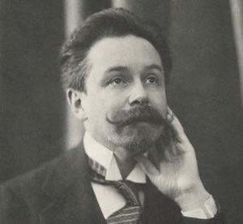

## Наша миссия

- Создать сообщество, где ведутся беседы об искусстве и жизни, объединяющие единомышленников.
- Создать высококачественную музыкальную школу и учебную среду для занятий фортепиано и общего культурного образования.
- Создать место для обмена и распространения [информации](/ru/post/) о Скрябине и связанных с ним темах.

## Наш клуб

Члены Скрябинского клуба ведут активную работу по содействию культурной осведомленности, вовлечению и просвещению.

Участие в Клубе имени Скрябина включает в себя такие преимущества, как участие в конференциях, мероприятиях, концертах, встречах, лекциях, уроках и многое другое. 
Наша группа последователей и членов постоянно растет.

### Наши спонсоры

Вы хотите поддержать миссию клуба имени Скрябина финансово и стать нашим спонсором? [Свяжитесь с нами](/contact/).

