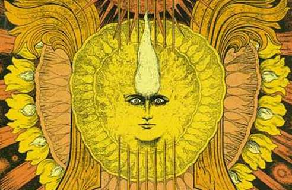
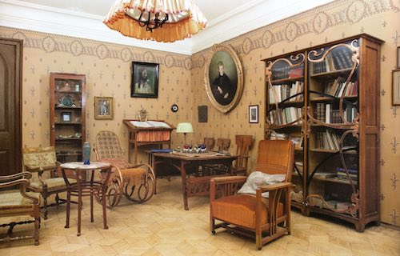

## About Scriabin Club

Scriabin, Roerich, Blavatsky, Rachmaninoff, Goethe, Nietzsche, Lovecraft, Liszt, Wagner, Bulgakoff, Berdjaeff, Tarkovsky, Laotse, Schopenhauer, Pletnev, Sokolov, Horowitz, Rubinstein, Prokoviev, Schiller, Beethoven, Chopin...

If any one of these names is familiar to you, you have found the right place!
Find out more about Scriabin Club on this page.

## Our mission

The mission of the Scriabin Club is to promote cultural enlightenment and engagement.
Club members discuss all kinds and forms of art, including philosophy.
We are constantly searching for new possibilities and ideas.

## Our causes

Our mission to promote cultural engagement can be summarised in the following tasks:

### Promoting Music

Scriabin club actively promotes the music of the composer Alexander Scriabin, including the promotion of performances and musicians.
We organise concerts, ranging from small scale living room concerts to famous concert halls.
Moreover, we provide a wide range of musical-related activities, such as lectures and presentations.

### Providing Education

Our mission is to bring high quality musical and cultural education to people of all ages and backgrounds, from beginners to advanced musician.
The education at Scriabin club also includes lectures and presentations on musical and cultural related subjects, such as music theory, history of culture and art, philosophy and much more.

### Providing Information

With Scriabin club we provide a platform, where Scriabin club members can share valuable information about his music, himself, his philosophy, the culture of the time and much more.
The contents on the website will always be publicly available, and Scriabin club membership will not be required for the viewing of information.

### Growing Community

Scriabin club connects the enthusiasts of Scriabin, philosophy and culture in general.
Here, dialogues and conversations between the club members take place.
We are constantly searching and sharing new ideas, having lectures, frequent conferences and discussions.
The Scriabin club community has an international appeal, a huge network of connections in the world of music and art, which members of Scriabin club can rely on.

## Our History

The Scriabin Club was founded in October 2020 as an effort to create a home for people interested in Scriabin, art and philosophy in general.
Scriabin Club is inspired by and dedicated to the composer, pianist, philosopher and visionary artist Alexander Nikolayevich Scriabin (1872-01-06 - 1915-04-27), everything that surrounded him and everything he stood for.

*Alexander Nikolayevich Scriabin*

Scriabin Club is the place for the community of people, who would like to be part of experiencing and promoting cultural enlightenment.
Essentially, we are our community.

Scriabin Club has been founded by [Martin Kaptein](https://kaptein.me/).

*Martin Kaptein founder of Scriabin Club*
