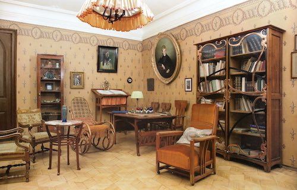

## Vorteile für Mitglieder

Für Mitglieder des Skrjabin Klubs gibt es volgende Vorteile:

- Teilnahme an online und offline Veranstaltungen wie Versammlungen und Konferenzen.
- Teilnahme an online und offline Vorträgen, Vorlesungen und Präsentationen.
- Teilnahme an Workshops.
- Zugang zu privaten Konzerten (neben öffentlichen Konzerten).
- Rabatte für Unterrichte und Lektionen.
- Rabatte für öffentliche Konzerte.
- Zugang zu den Verbindungen von dem Skrjabin Klub, zu dem Verein und der Gesellschaft.
- Zugang zu dieser Webseite, um Informationen zu publizieren, über Erfahrungen berichten usw.
- Zugang zum chat server für Mitglieder, um ideen und Material zu Teilen.
- Möglichkeit auf dem Subreddit des Skrjabin Klubs zu posten.
- Zugang zur privaten Telegram Gruppe des Skrjabin Klubs.

Mitglieder werden aktiv beteiligt in online Kommunikationen des Skrjabin Klubs.

## Mitglied werden

Wollen Sie Mitglied des Skrjabin Klubs werden?
Interessiert Sie Scriabin, Kunst und Philosophie generell?

So können Sie dem Skrjabin Klub beitreten:

1. Schicken Sie uns eine E-Mail, und erzählen Sie kurz über sich selbst und warum Sie dem Skrjabin Klub beitreten wollen.
2. Wir werden Ihnen Antworten (abhängig von der Anzahl der Anmeldungen kann dies eine gewisse Zeit dauern), und falls der Skrjabin Klub zu Ihnen passt werden wir Sie für ein kurzes Gespräch mit einem oder mehreren Mitgliedern des Skrjabin Klubs einladen. Dies ist ein informelles Gespräch, eine Vorbereitung ist nicht notwendig.
3. Wir würden es sehr schätzen falls Sie den Skrjabin unterstützen, und zwar nicht unbedingt finanziell sonder rein praktisch, wie zum Beispiel:
- Material über Skrjabin, oder über Kunst im Allgemeinen auf unserer Webseite publizieren.
- Online (über Social Media) oder Physische (z.B. flyer etc.) Werbung für den Skrjabin Klub.
- Übersetzung von Teilen unserer webseite.
- Aufnahmen von Musik.
- Was anderes, was Sie selber bestimmen.

Dies sollte nicht zu viel Zeit in Anspruch nehmen, und ist eine Möglichkeit unseren Klub praktisch zu unterstützen.
Wir fragen von regulären Mitgliedern um keine finanzielle Unterstützung.
Der Grund das wir diese Prozedur gewählt haben, ist das wir Glauben das jede Person von jedem Alter und Abstammung aktiv teilnehmen kann.

## Sponsor des Skrjabin Klubs werden

Der Skrjabin Klub sucht momentan nach Sponsoren, die unsere Aktivitäten, Pläne und Ziele praktisch sowie finanziell unterstützen wollen.

Als Dank bieten wir **den Sponsoren des Skrjabin Klubs** neben den Vorteilen für reguläre Teilnehmer und Mitglieder unseres Klubs folgende Vorteile und Begünstigungen:

- Organisation und Durchführung privater Konzerte für Sponsoren.
- Wöchentliche Unterhaltungen und Protokollierungen über den Skrjabin Klub (online).
- Planung von zukünftigen Aktivitäten des Skrjabin Klubs mit Sponsoren.
- Auf der [Homepage](/de/) des Skrjabin Klubs bekommen Sie ein Sponsor Profil.
- Das Gewissen die Pläne für die Zukunft des Skrjabin Vereins unterstützt zu haben.

## Unsere Mission

Unsere Mission ist es um Kulturelles Bewusstsein und Engagement zu fördern.
Im Skrjabin Klub findet Diskurs über alle Formen von Kunst sowie Philosophie statt.

## Unsere Ziele

Unsere Ziele können unter folgenden Kategorien zusammengefasst werden:

### Förderung der Musik Skrjabins

Der Klub Skrjabins fördert die Musik des Komponisten Alexander Skrjabin.
Des weiteren befördern wir auch Aufführungen der Musik Skrjabin beziehungsweise Musikanten.
Der Skrjabin Klub organisiert Konzerte, Lesungen und Präsentationen.

### Bildung

Das Ziel des Skrjabin Klubs ist um qualitativ hochwertige Bildung in der Musik aber auch Kultur allgemein zugänglich und möglich zu machen.
Diese Bildung soll auch, neben Musik-technischen Themen wie das bespielen eines Instrumentes oder Theorie, Vorträge und Lesungen zu kulturell naheliegenden Themen wie zum Beispiel Geschichte und Philosophie beinhalten.

### Ort für Information

Der Skrjabin Klub fungiert als Plattform, wo Mitglieder unseres Vereines wertvolle Informationen und Mitteilungen über Skrjabin, seine Musik, Philosophie Kultur im Allgemeinen und noch viel mehr austauschen können.
Diese Informationen sollen öffentlich zugänglich sein und bleiben.

### Gemeinschaft, Verein, Klub

Der Verein beziehungsweise Skrjabin Klub verbindet die Liebhaber Skrjabins, Philosophie und Kultur im Allgemeinen.
Hier finden Diskussionen und Dialoge zwischen den Mitgliedern des Skrjabin Klubs statt.
Wir suchen konstant nach neuen Ideen, haben Lektüren und Konferenzen. Der Skrjabin Verein geniesst eine internationale Bekanntheit, von der unsere Mitglieder profitieren können.

## Unsere Entstehung

Der Skrjabin Klub wurde im Oktober 2020 gegründet mit der Idee um Kulturelles Bewusstsein zu fördern, als ein Ort für alle interessierten an Skrjabin, aber auch Kunst und Kultur generell.
Der Skrjabin Klub ist gewidmet an den Komponisten, Pianisten, Philosophen und Visionär Alexander Nikolayevich Skrjabin (1872-01-06 - 1915-04-27), und alles was ihn umgab und alles wo er für steht.

*Alexander Nikolayevich Skrjabin*

Wir sind der Ort für unsere Community von Leuten, die zusammen Kulturelles Bewusstsein fórdern wollen.

Der Skrjabin Klub wurde von [Martin Kaptein](https://kaptein.me/) gegründet.

*Martin Kaptein, Gründer des Skrjabin Klubs*
