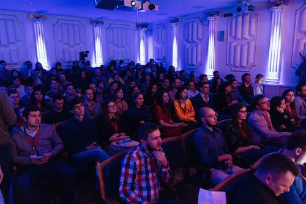
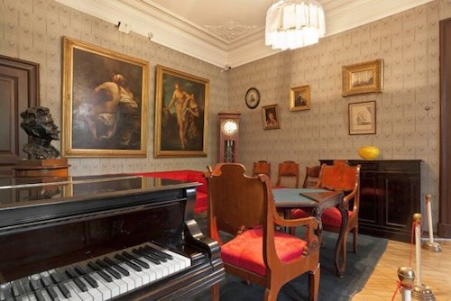
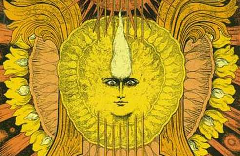
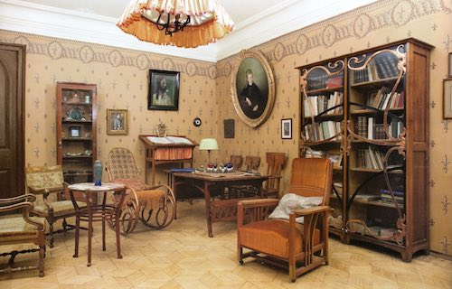

## Deelname en Lidmaatschap bij de Scriabin Club

### Voordelen voor Leden van de Club

Deelnemers en leden van de Scriabin Club genieten van een groot aantal privileges, zoals:

- Passieve en actieve deelname aan online en offline conferenties en vergaderingen.
- Deelname aan online en offline lezingen, presentaties en gesprekken.
- Deelname aan workshops.
- Toegang tot privé concerten en conventies.
- Kortingen voor muziek, theorie, en coaching lessen/sessies.
- Kortingen voor openbare concerten.
- Toegang tot de Scriabin Club sociëteit en gemeenschap.
- Mogelijkheid om publiek informatie te plaatsen op deze website.
- Toegang to privé chat server exclusief voor deelnemers van de Scriabin Club, om ideeën en materiaal uit te wisselen.
- Mogelijkheid om op de officiële subreddit van Scriabin Club te posten.

Deelnemers worden actief betrokken en geïnformeerd in E-mail vergaderingen.

### Lid van de Scriabin Club worden

Om lid van de Scriabin Club te worden, is er de volgende selectieprocedure:

1. Neem contact met ons op, en vertel kort over Uzelf.
2. Samen vinden wij een manier, waarop U een dienst kan doen voor de Scriabin Club, zoals bijvoorbeeld:
- Publicatie van materiaal, research, meningen etc. over Scriabin, zijn wereld  op onze website.
- Online (bijvoorbeeld Social Media) of fysieke promotie (flyers) of reclame voor de Scriabin Club.
- Vertaling van materiaal op onze website naar andere Talen.
- Toesturen van opnames, beeldmateriaal, media etc..
- Iets anders, wat wij van ter voren afspreken.
3. Informeel gesprek met de oprichter van de Scriabin Club.

De reden voor deze selectie procedure is het feit, dat wij geloven, dat elke persoon, van elke achtergrond en leeftijd actief kan meedoen aan onze Club.
Wij willen een plek worden voor actieve deelnemers, in tegenstelling tot "passieve" consumenten.

## Donateur en Sponsor van de Scriabin Club worden

Wij zijn op zoek naar sponsoren die de visies en doelen van de Scriabin Club zouden willen ondersteunen.

Als dank, bieden wij voor onze sponsoren naast de mogelijkheden en voordelen voor onze leden nog volgende voordelen:

- Mogelijkheden voor het organiseren van privé concerten voor sponsoren.
- Privé een op een gesprekken en wekelijkse reportages van de gang van zaken.
- Inbreng van de Sponsoren op de toekomstige Evenementen en activiteiten van de Scriabin Club.
- Het geweten om de goede doelen van de promotie van cultureel bewustzijn ondersteund te hebben.
- U komt op de hoofd pagina en homepage van de Scriabin Club.
- Op de Scriabin Club website krijgt U een apart profiel, met foto, korte introductie, links etc..

Als U geïnteresseerd bent, en met ons wilt praten, kan U het beste met ons contact opnemen.

## Wat wij doen

### Muziek

Scriabin Club is actief in het promoveren van de muziek van de grote componist Alexander Scriabin.
Wij bevorderen hierbij ook optredens van muzikanten.
Verder organiseert de Scriabin Club concerten op grote schaal en kleine schaal (huiskamer concerten).
Ook bieden wij een groot aantal activiteiten aan, zoals presentaties en lezingen.

### Educatie en opleiding

Onze missie is het om muziek onderwijs van hoge kwaliteit voor mensen van alle achtergronden en leeftijden toegankelijk te maken.
Naast muziek educatie (zoals pianolessen) bieden wij lezingen en presentaties over muziek- en cultuur gerelateerde thema's aan, zoals theorie, geschiedenis van cultuur en kunst, filosofie en nog veel meer.

### Informatie

Scriabin Club is een platform, waar leden van onze club en vereniging waardevolle informatie over Scriabin, zijn muziek, filosofie, cultuur geest van zijn tijd en veel meer kunnen delen.
Deze informatie wordt publiek op deze website geplaatst.

### Gemeenschap, genootschap, vereniging, club

De Scriabin Club en Vereniging verbindt enthousiasten en deskundigen van Scriabin, filosofie en cultuur algemeen.
Hier vinden dialogen en gesprekken tussen de leden plaats.
Wij zoeken naar nieuwe ideeën en vormen, hier vinden lezingen, vergaderingen en discussies plaats.
De Scriabin Club heeft een international podium, en een groot netwerk van contacten over de hele wereld, waar onze leden gebruik van kunnen maken.

## Wie wij zijn

Scriabin Club is een gemeenschap van actieve en betrokkene mensen, wie deel uitmaken van het beleven en promoveren van cultureel bewustzijn.

De Scriabin Club is geïnspireerd door en toegewijd aan de componist, pianist, filosoof en visionair Alexander Nikolayevich Scriabin (vaak Skrjabin of Skryabin gespeld) (1872-01-06 - 1915-04-27), alles wat hem omgaf en waar hij voor stond.

De oprichter van de Scriabin Club is Martin Kaptein. Zie [de website van Martin Kaptein](https://kaptein.me/) voor meer informatie over hem.

