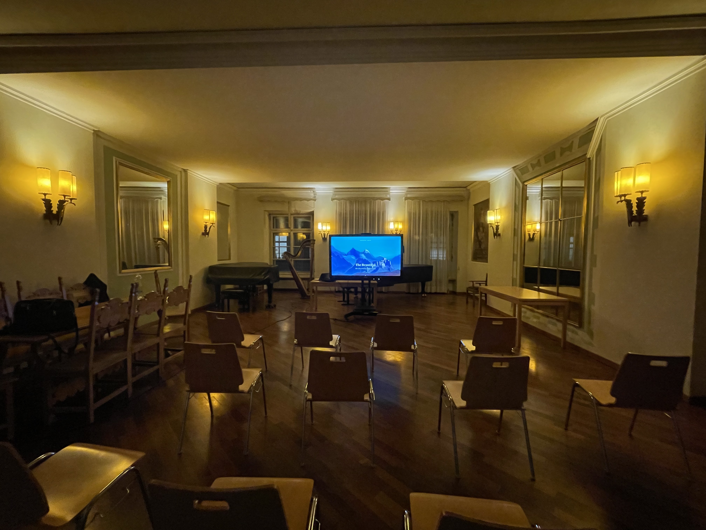
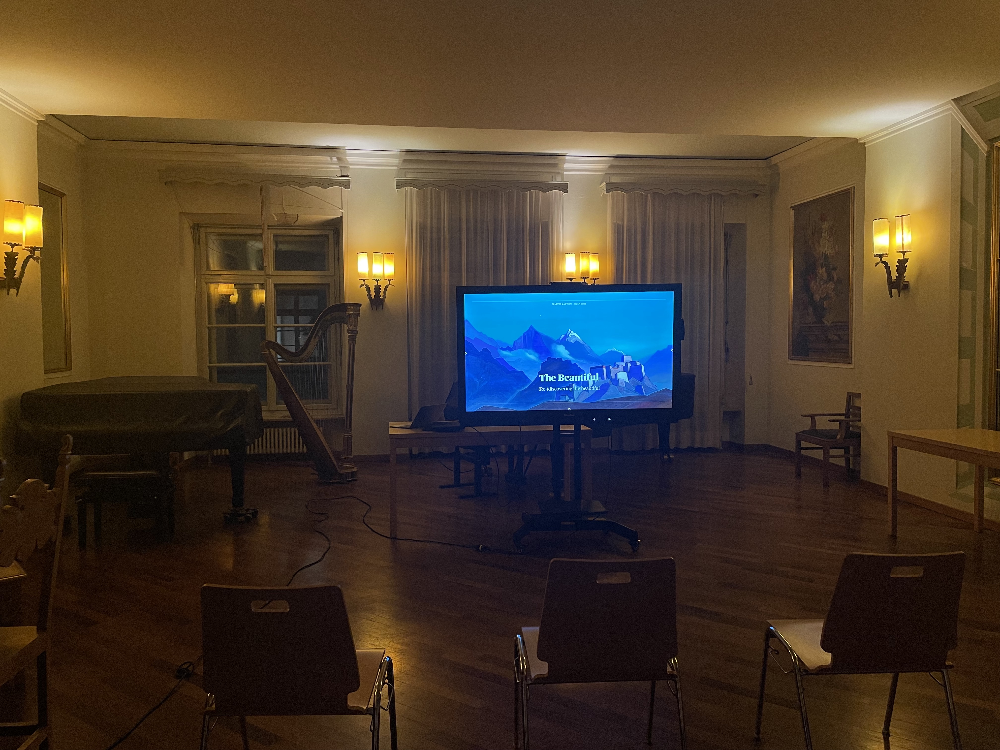

## Looking back at a Scriabin Club lecture

On January 30th 2023, Scriabin Club hosted its fist official lecture at a University/Conservatory.
This took place at the **HIGHER INSTITUTE FOR MUSICAL EDUCATION “CLAUDIO MONTEVERDI” CONSERVATORY**, at Piazza Domenicani 19, 39100 Bolzano (BZ), Italy.
In the following we will provide a look back at that event.

### Lecture about the Beautiful

The topic of the lecture was (Re-)discovering the beautiful, and was done by Scriabin Club founder Martin Kaptein.
The lecture itself lasted around 1 hour, followed with 1,5 hours of interactive discussion with the around 30 participants from all disciplines and different backgrounds.

The ensuring discussion yielded very inspiring ideas, which were shared in a familiar and warm atmosphere.
According to surveys this event was received very well and there are desires to elaborate on it and redo it in the coming summer months of 2023.

### Playback

A shorter version of this lecture was later recorded and distributed on YouTube.

<iframe width="560" height="315" src="https://www.youtube.com/embed/3-IlPgdl5hs" title="YouTube video player" frameborder="0" allow="accelerometer; autoplay; clipboard-write; encrypted-media; gyroscope; picture-in-picture; web-share" allowfullscreen></iframe>

Here is [the direct link to this lecture on YouTube](https://www.youtube.com/watch?v=3-IlPgdl5hs).

If you prefer the Odysee video platform, you can [find the lecture here](https://odysee.com/@martinkaptein:9/rediscovering_beautiful:e).
