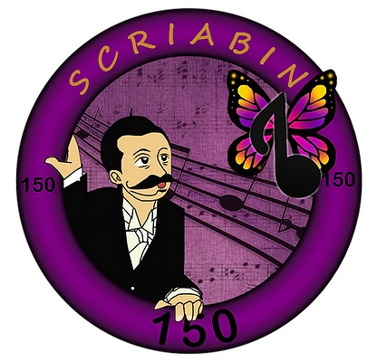

## Announcing presentation at Scriabin 150 Online Festival

For the 150 anniversary of Alexander Nikolayevich Scriabin, the Scriabin Club will be featured at the Scriabin 150 Online Festival.
The Scriabin 150 Festival is hosted and organized by Sherry Grant from New Zealand.
She brings this festival in conjunction and collaboration with the Scriabin Society of America.

See [this website for more information about the Scriabin online festival](https://www.artsinfinitypress.com/scriabin150). 
Or [find out more about the Scriabin Society of America here](https://scriabinsociety.com/about/).

Over these three days there will be presentations and recitals by musicians, artists and philosophers.

### Details

The Festival will take place from **11-13th November 2022** from **10am - 6pm, Eastern Time** online, via Zoom.

### Founder of Scriabin Club at Scriabin 150 Online Festival

The founder of the Scriabin Club, Martin Kaptein, will represent the Scriabin Club with an in-depth presentation about the practical uses and implications of Scriabins synaesthesia.
His presentation will be taking place on **11th of November** at **12:00-12:30 pm (Eastern Time)**.
