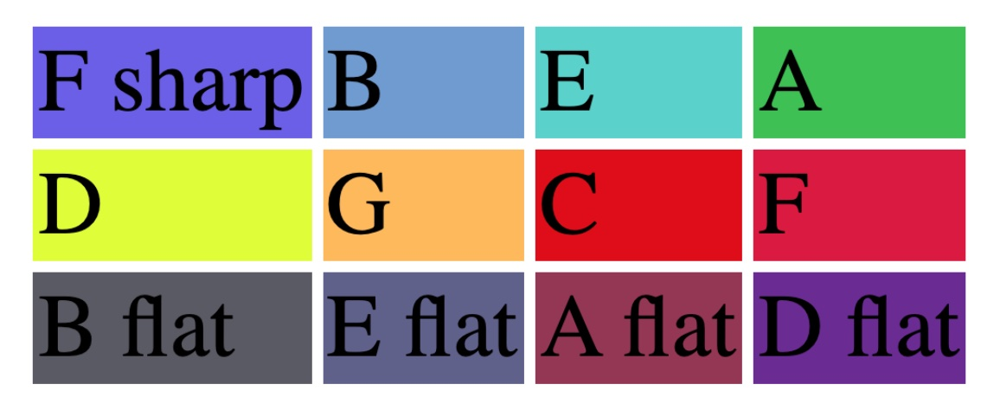

*Presentation of Martin Kaptein's Master Research Thesis*

## Colors in Alexander Scriabin’s Sonata No.8 Op.66: Exploring the relation between color and harmony in Scriabin’s music

This is a first step to revolutionize perception of music, with wide-ranging effects for piano performance practice, music education and audience perception.

<iframe width="560" height="315" src="https://www.youtube.com/embed/DfBFm_D1EzM" title="YouTube video player" frameborder="0" allow="accelerometer; autoplay; clipboard-write; encrypted-media; gyroscope; picture-in-picture" allowfullscreen></iframe>

See [the video presentation of my research here](https://www.youtube.com/watch?v=DfBFm_D1EzM).

### Thesis abstract

Alexander Scriabin is a composer known to have had synaesthesia, however only one work exists with a documented color accompaniment, namely his 5th Symphony Op.60 *Prometheus: The poem of fire*.
It was valuable for multiple reasons to explore this system and apply it to a different piece of his, his Piano Sonata No.8 Op.66, with the ultimate goal of performing this sonata with a color accompaniment worked out according to the schemata Scriabin applied to the 5th symphony.
The central goal is the element of historical performance practice - to create a performance practice with colours that is historically informed by Scriabin’s system as derived from the 5th symphony.

The values presented by this research cover a deeper understanding of Scriabin’s harmony, such as his reliance on dominant 7 chords, and motific work, such as the importance of augmented motifs, his synaesthesia, very deeply interconnected with the latter, as well as practical aspects that come with performing a Scriabin piece with a color accompaniment.
The latter aspects include discovering ways to choose appropriate colors and synchronize the switching of colours with a live piano performance, as well as detecting noticeable changes in my own piano performance, i.e. how the process of adding colors to the 8th sonata significantly influenced my way of interpreting the work.
These unexpected observation also included other fields, such as musical education.

### Link to paper and references

You can find [the full master's research thesis paper here](martin_kaptein-scriabin-colors-in-sonata-8.pdf).

*Reference of Scriabin's colors as deducted by my research*

Hex color reference:

Note | Color
--- | ---
F sharp | #695AE9
B | #6E9AD2
E | #55D1CB
A | #36C14E
D | #DFFF0E
G | #FFBA54
C | #E00404
F | #DC143C
B flat | #5A5A63
E flat | #60608C
A flat | #953553
D flat | #6B2594

<iframe width="560" height="315" src="https://www.youtube.com/embed/oT5jOBXDwME" title="YouTube video player" frameborder="0" allow="accelerometer; autoplay; clipboard-write; encrypted-media; gyroscope; picture-in-picture" allowfullscreen></iframe>

[Video of my performance of the Sonata No.8 by Scriabin synchronized with colors](https://www.youtube.com/watch?v=oT5jOBXDwME).

Find the [score analysis of Scriabin's 8th sonata here](scr-son-8-ann-ff.pdf).
