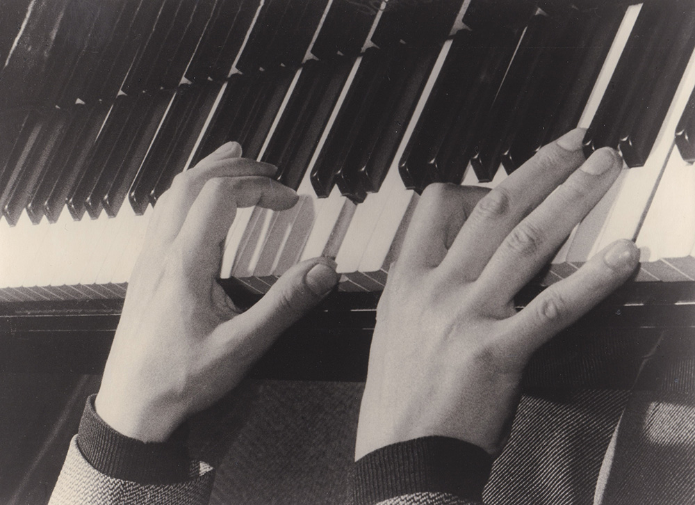

## Scriabin Club in Bolzano - an initiave of Musica in aulis, dedicated to Michelangeli

On the 8th of December 2022 the debut of Scriabin Club found place in the *Palazzo Mercantile* of the beautiful city of Bolzano, South Tyrol, Italy.
This event took place in collaboration with [Musica in aulis](https://www.facebook.com/musicainaulis) as well as the director of the Conservatory of Bolzano, **Giacomo Fornari**, and was dedicated to the famous Italian pianist and musician **Arturo Benedetti Michelangeli**.

Similar to how weeks earlier, all Scriabin's 10 sonata's sounded in Bolzano, this time his Poeme *Vers la flamme* Op.72 was performed among a selection of Scriabin Preludes by the founder of Scriabin Club, **Martin Kaptein**.

### Pictures of Arturo Benedetti Michelangeli

During this event there was a in-depth lecture about the interesting personality of Arturo Benedetti Michelangeli.
Together with this lecture a picture exhibition of the famous photographer **Luca Pedrotti** with Michelangeli as his subject was shown.

An interesting parallel to those historic photographs was drawn by **Mauro Mancassola**, who captured photographs that evening.
Here he captured the hands of Martin, in the same style that Luca Pedrotti captured Michelangeli's half a century earlier:

*Photo by Mauro Mancassola of Martin Kaptein, same style as Luca Pedrotti captured Arturo Benedetti Michelangeli*

*Old photograph by Luca Pedrotti of Arturo Benedetti Michelangeli*

## Music, Photographs and Philosophy

As Scriabin Club strives to promote a deeper dialogue about Scriabin, Art and Life, this time this happened too:
In the same spirit as Musica in Aulis presented the personality of Michelangeli, Scriabin's music was preceded by a short philosophical introduction, that captured the essence of his *Vers la flamme*.

*The founder of Scriabin Club, Martin Kaptein, talking about the meaning of Scriabin's Op.72*

Read more [about an astrological way to interpret Scriabin's Vers la flamme here](/post/vers-la-flamme-astronomy/).
