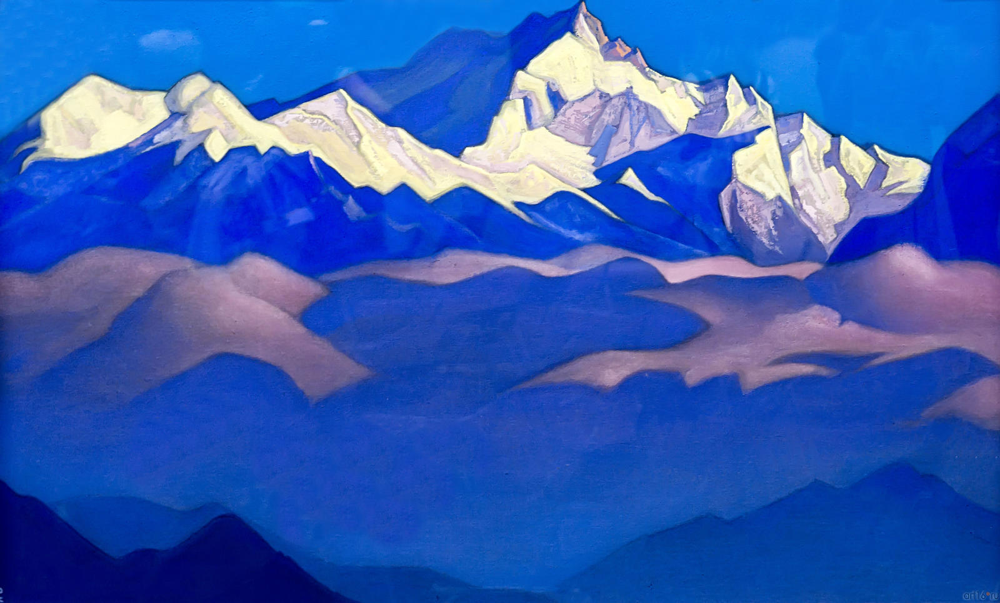
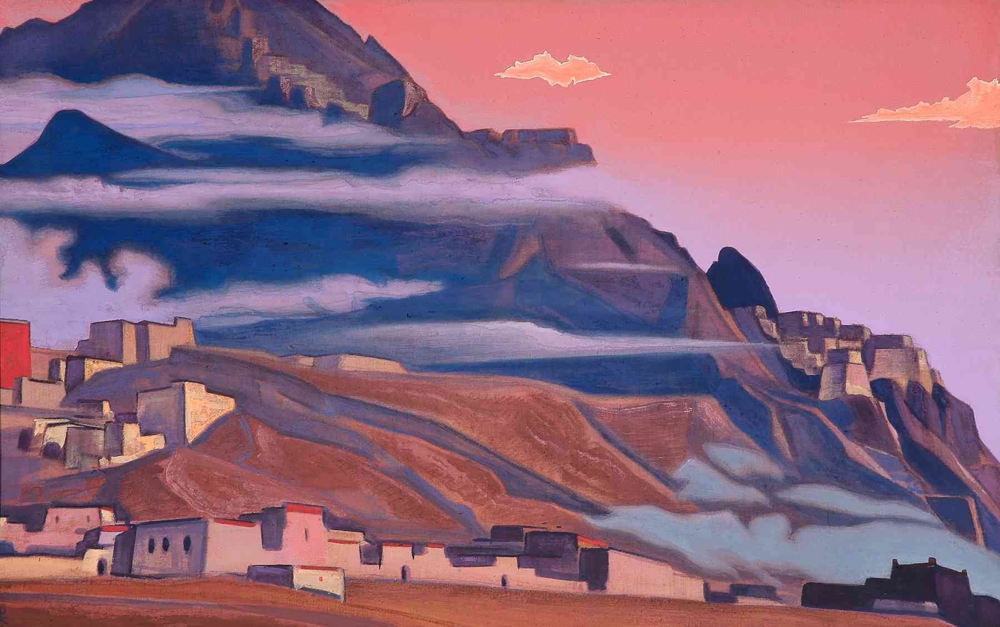

## Очарование неизвестностью (и горами)

На первый взгляд *Александр Скрябин*, *Николай Рерих* и *Г.П. Лавкрафт* могут иметь не так уж много общего.
Все они были людьми разных талантов: *Скрябин* как композитор, *Рерих* как художник и *Лавкрафт* как писатель.
И все же есть один элемент, который объединяет их вместе, объединяет дух их времени/эпохи (*Zeitgeist*).

### Представляем Скрябина, Рериха и Лавкрафта

Время, в которое они все трое жили, примерно совпадало.
В то время как нет никаких доказательств того, встречался ли Скрябин с двумя другими, есть множество свидетельств того, что Николай Рерих и Г.П. Лавкрафт встречались и знали о существовании друг друга.
Тем не менее, увидеть Рериха и Лавкрафта в московской квартире Скрябина было бы вполне реально, поскольку последний любил встречаться с современниками и делиться с ними идеями.
Все эти три человека воплощают дух и основную идею Скрябинского клуба.
 
## Гималайские горы - связующий элемент

Так что же связывает этих трех джентльменов?
Если бы вы ответили на этот вопрос одним словом, то это было бы: **Горы**.

Действительно, Рерих, Лавкрафт и Скрябин разделяли очарование гор.
Давайте посмотрим на некоторые примеры:

У Скрябина была идея исполнить свой шедевр (который он, к сожалению, так и не закончил), [the mysterium (слушать здесь)](https://www.youtube.com/watch?v=V4YSysUn-Bk) в Гималайских горах.
Существуют и другие проекты по перенесению музыки Скрябина в Гималайские горы, например, [Scriabin in the Himalayas initiative (trailer)](https://www.youtube.com/watch?v=w1Tvx_JoJY0) Майкла Харди и Мэтью Бенгтсона.
В конце концов, даже [Скрябинский "Прометей: поэма огня"](https://www.youtube.com/watch?v=V3B7uQ5K0IU&t=587s) имеет четкую сюжетную линию, которая может быть связана с концепцией гор.

У Рериха есть очень четкая связь с Гималайскими горами: В конце своей карьеры он жил в Северной Индии и создал множество шедевров живописи Гималайских гор.

В Скрябинском клубе мы также используем его картины именно по причине философских параллелей с духом Скрябина.

Лавкрафт также интересуется таинственным и сверхъестественным.
Одна из моих любимых его работ - *В горах безумия*.
Это произведение не только конкретно связано с горами, но и напрямую ссылается на картины Рериха:

> Последний круг путешествия был ярким и будоражащим воображение, великие бесплодные вершины тайн постоянно вырисовывались на западе, когда низкое северное солнце полудня или еще более низкое пасущееся у горизонта южное солнце полуночи изливало свои туманные красноватые лучи на белый снег, голубоватые ледяные и водные полосы и черные куски обнаженного гранитного склона. Над пустынными вершинами проносились бушующие прерывистые порывы ужасного антарктического ветра, чьи каденции иногда несли в себе смутные предчувствия дикого и полуразумного музыкального пения, с нотами, простирающимися в широком диапазоне, и которые по какой-то подсознательной мнемонической причине казались мне тревожными и даже смутно страшными. Что-то в этой сцене напомнило мне странные и тревожные азиатские картины Николая Рериха, а также еще более странные и тревожные описания зловещего сказочного плато Ленг, которые встречаются в страшном Некрономиконе безумного араба Абдула Альхазреда.

Мы ясно видим, что все три художника черпают вдохновение в горах, особенно в Гималайских горах.

### Попробуйте совместить

Я призываю вас [послушать mysterium Скрябина](https://www.youtube.com/watch?v=V4YSysUn-Bk), посмотреть следующую картину Рериха и прочитать следующий отрывок Лавкрафта:

> На некоторых вершинах, однако, регулярные кубические и валовые образования были смелее и проще; они вдвойне фантастически похожи на азиатские руины холмов, нарисованные Рерихом. Распределение криптических пещерных устьев на вершинах, покрытых черным снегом, казалось примерно равномерным, насколько можно было проследить хребет.
> Несмотря на все преобладающие ужасы, у нас оставалось достаточно чисто научного рвения и авантюризма, чтобы задаться вопросом о неизвестном царстве за этими загадочными горами.

### Почему горы?

Остается вопрос, почему все три художника, Лавкрафт, Рерих и Скрябин, так сильно вдохновлены горами.
Является ли это простым совпадением?
Что такого значимого для нас предлагают горы?

На этот вопрос трудно ответить с помощью чистой логики.
Возможно, это чувство достижения.
А может быть, это просто тайна и легенда.
Кто знает, может быть, это особая связь с буддизмом.

В любом случае, я думаю, было бы излишним отвечать на этот вопрос в этом посте.
Если вы прочитаете его, то, вероятно, уже будете иметь представление.
