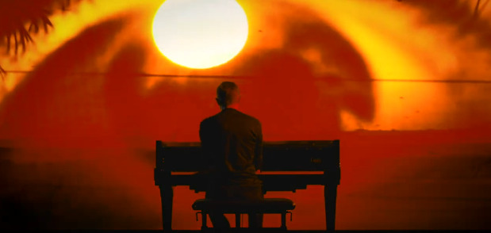

*A contribution to the Scriabin Club kindly provided by Peter Barthel.*

Composer Alexander Scriabin (1872-1915) believed that the world would eventually be immersed in, and purified by the heat of the sun: “an ecstatic abyss of sunshine.” This film was produced on the occasion of the composer's 150th anniversary (1872-2022).

## The Film

<iframe width="560" height="315" src="https://www.youtube.com/embed/Ay0jsvaFeUU" title="YouTube video player" frameborder="0" allow="accelerometer; autoplay; clipboard-write; encrypted-media; gyroscope; picture-in-picture" allowfullscreen></iframe>

[Direct link to YouTube](https://youtu.be/Ay0jsvaFeUU)

### Description

Regardless of whether we listen to Vers la flamme as a sort of transfiguration of Wagner’s Feuerzauber concluding Die Walküre in the same key of E Major, or as a potential 11th Sonata based on eleven pitch sets anticipating the harmonic language of modern jazz; regardless of whether we look at this “Roman candle of increasing, magnifying blazes,” as Faubion Bowers describes the piece, as a sound depiction of the kinesthetic theory of heat or as a metaphysical inner journey towards illumination and ecstasy; regardless of whether we highlight its synesthetic connotations, the subtlety of its polyrhythmic texture or other structural elements, it is vital to remember that this enthralling poem for piano, initially conceived for orchestra, was composed at the outbreak of the First World War and a few months before Scriabin’s unexpected death at 43. 

More powerfully than any other art, music can be the metaphor for a cataclysm, although the Greek term literally refers to the destructive potential of the water element and not of fire (κατά, ‘down’ + κλύζειν, ‘to wash’ = ‘to inundate’). "Comme une fanfare", Scriabin specifies in the score, when the music reaches its climax, making the piano sound like the trumpets of the Apocalypse. Apart from any teleological consideration, more than a century after its composition Vers la flamme cannot but conjure up the grave danger of human extinction due to global warming.

“Это катастрофа!” were Scriabin’s last desperate words, before entering the last phase of his agony. ‘Catastrophe’, another Greek term, means ‘overturning’ (κατά, ‘down’ + στρέφειν, ‘to turn’), and it is rather significant that the ascending minor 2nd we hear at the beginning keeps recurring throughout the piece in its reversed descending version: two adjacent notes to represent life and death as opposite sides of the same coin. Scriabin’s symbolic juxtaposition of these two chromatic elements in contrary motion brings us back to Wagner and to the leitmotifs of Desire and Suffering (Lust und Schmerz), the combination of which originates the famous ‘Tristan Chord’. This very theme from Tristan und Isolde will be evoked again in Scriabin’s last composition, namely in the Prélude op. 74 no. 1.

In April 1915, while the composer was fighting against septicemia, the entire world was being upset, or better ‘overturned’ by the devastating flames of war. “War belongs to our souls as an archetypal truth of the cosmos,” says James Hillman in A Terrible Love of War (2004), one of the most insightful studies on the psychology of war ever written. “It is a human accomplishment and an inhuman horror, and a love that no other love has been able to overcome. To this terrible truth we may awaken, and in awakening give all our passionate intensity to subverting war’s enactment, encouraged by the courage of culture, even in dark ages, to withstand war and yet sing.” 

*Marco Rapetti, October 2022*

## Credits

Solar Dynamics Observatory images and video appear by courtesy of NASA/SDO and the HMI, AIA, and EVE science teams. The support of SDO Project Scientist Dean Pesnell is gratefully acknowledged.

Pianist Marco Rapetti
Director, editor, and colorist Alex Torres
DOP Alessandro Bartoletti
PA and assistant-editor Laura González
Sound Angelo Ubbiali

Location manager Elisa Corbellini

Produced by Peter Barthel, Godelieve Cooymans, and Alex Torres

Production Company ALTO
Location Fabbrica di Lampadine, Milano
Steinway piano Griffa Pianoforti

peterbarthel.nl
proaxxes.com
marcorapetti.com
altostories.com
sdo.gsfc.nasa.gov
